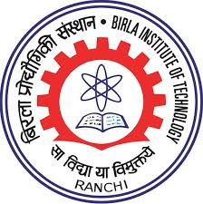
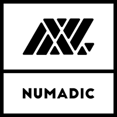
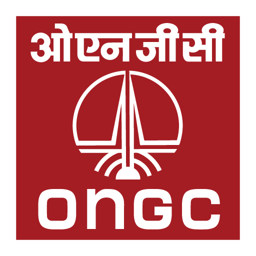

<head>

</head>

<button onclick="topFunction()" id="myBtn" title="Go to top">Top</button>



"What I Cannot Create, I Do Not Understand."
 
"Know how to solve every problem that has been solved."
 
&emsp;&emsp;&emsp;&emsp;&emsp;&emsp;&emsp;&emsp;&emsp;&emsp;&emsp;&emsp;&emsp;&emsp;&emsp;&emsp;&emsp;&emsp;&emsp;&emsp;&emsp;
- Richard Feynman
 
&emsp;&emsp;&emsp;&emsp;&emsp;&emsp;&emsp;&emsp;&emsp;&emsp;&emsp;&emsp;&emsp;&emsp;&emsp;&emsp;&emsp;
(1988, Caltech, his last blackboard notes)

# About Me

Lorem ipsum dolor sit amet, consectetur adipiscing elit. Suspendisse eu mi vel libero vestibulum imperdiet. Nam non lectus at purus placerat bibendum ac vel ipsum. Class aptent taciti sociosqu ad litora torquent per conubia nostra, per inceptos himenaeos. Vestibulum molestie ultricies ullamcorper. Nullam quis tortor lobortis, hendrerit elit a, malesuada tortor. Curabitur sed sollicitudin odio, at posuere ante.

How to pronounce my name?
<audio controls>
  <source src="audio/robot.mp3" type="audio/mpeg">
  
Your browser doesn't support HTML5 audio. Here is
     a <a href="audio/robot.mp3">link to the audio</a> instead.

</audio>

\\[
\begin{split}
r &= \begin{pmatrix} R & 0 \\\\ 0 & 1 \\\\ \end{pmatrix} \\\\\\\\
t &= \begin{pmatrix} I & T \\\\ 0 & 1 \\\\ \end{pmatrix}
\end{split}
\\]

 

# Research Interests

* Real-Time Systems
* Embedded Systems
* Cyber-Physical Systems
* Internet of Things
* Wireless Sensor Networks
* Computer Networks
* Robotics
* Medical Devices

 

# Education

|  |  |
| :---: | :---: |
| {:height="100px" width="100px"}   **Birla Institute of Technology, Mesra**   | **Aug. 13 - Jun. 17**,   Department of Electronics and Communication Engineering,   Bachelor of Engineering (First Class with Distinction),  **CGPA: 8.07/10.00** (equivalent to **80.70%**)   [Degree](https://drive.google.com/file/d/17GNP998P4cYmE27QAbyp5UAo8KkBX3Uw/view?usp=sharing){:target='_blank'}  [Transcript](https://drive.google.com/file/d/1pDvEFoeXen2UTtuZxRjV01oSdienWoaf/view?usp=sharing){:target='_blank'} |

 

# Experience

|  |  |
| :---: | :---: |
| {:height="100px" width="100px"}   **IIT Bombay**   | **Jan. 19 - Present**,  Senior Project Technical Assistant,  Embedded Real-Time Systems Lab,  Computer Science and Engineering Department   |
| {:height="100px" width="100px"}   **CSIR   National Institute of Oceanography**   | **Jun. 18 - Jan. 19**,  Project Assistant II,   Automonous Weather Station Lab,   Marine Instrumentation and Computer Department   |
| {:height="100px" width="100px"}   **Numadic**   | **Feb. 17 - May 18**   **Feb. 17 - Jun. 17**, Firmware Intern   **Jul. 17 - Mar. 18**, Firmware Developer   **Apr. 18 - May 18**, Software Developer   |
| {:height="100px" width="100px"}   **IIT Kanpur**   | **May 16 - Jul. 16**,  Undergraduate Researcher,   Summer Undergraduate Research and Excellence Program,  Mechanical Engineering Department   |
| {:height="100px" width="100px"}   **Oil and Natural Gas Corporation**   | **May 15 - Jun. 15**,   Summer Intern,   Regional Electronics Lab, Vadodara   |
| {:height="100px" width="100px"}   **Women's Organisation for   Socio-Cultural Awareness**   | **May 14 - Jul. 14**,   **Dec 14 - Jan. 15**,   **Dec 15 - Jan. 16**,   Volunteer Teacher   |

 

# Selected Research Projects

Complete list of projects can be found [here](/portfolio/).

| **Firmware over-the-air (FOTA) for AVR based boards using ESP32**   									Jun. 19 - Present,  																							**IIT Bombay**  																							Kavi Arya, Sourav Jena, Kalind Karia, Prasad Trimukhi, Raj Kumar Bhagat, Soham Bhave   					**Links:** [Paper](google.com)					,  [Project Page](google.com)						,  [Video Demo](google.com)						, [Source Code](google.com)  					**Status: Ongoing**  																					Lorem ipsum dolor sit amet, consectetur adipiscing elit. Suspendisse eu mi vel libero vestibulum imperdiet. Nam non lectus at purus placerat bibendum ac vel ipsum. Class aptent taciti sociosqu ad litora torquent per conubia nostra, per inceptos himenaeos. Vestibulum molestie ultricies ullamcorper. Nullam quis tortor lobortis, hendrerit elit a, malesuada tortor. Curabitur sed sollicitudin odio, at posuere ante.    |
| **Push-Pop Algorithm for NAND Flash Devices**   Jun. 19 - Present,  					**Numadic, IIT Bombay**  																				Kavi Arya, Sourav Jena   															**Links:** [Paper](google.com)					,  [Project Page](google.com)						,  [Video Demo](google.com)						, [Source Code](google.com)  					**Status: In process of submission**  																			Lorem ipsum dolor sit amet, consectetur adipiscing elit. Suspendisse eu mi vel libero vestibulum imperdiet. Nam non lectus at purus placerat bibendum ac vel ipsum. Class aptent taciti sociosqu ad litora torquent per conubia nostra, per inceptos himenaeos. Vestibulum molestie ultricies ullamcorper. Nullam quis tortor lobortis, hendrerit elit a, malesuada tortor. Curabitur sed sollicitudin odio, at posuere ante.    |
| **Communication System for People with Neuromuscular Disease using Brain Computer Interface**   		Aug. 16 - May 17,  																							**Birla Institute of Technology, Mesra**  																Shahiruddin, Sourav Jena, Shivender Gupta, Zohaib Sheikh   												**Links:** [Paper](google.com)					,  [Project Page](google.com)						,  [Video Demo](google.com)						, [Source Code](google.com)  					**Status: Completed**  																Lorem ipsum dolor sit amet, consectetur adipiscing elit. Suspendisse eu mi vel libero vestibulum imperdiet. Nam non lectus at purus placerat bibendum ac vel ipsum. Class aptent taciti sociosqu ad litora torquent per conubia nostra, per inceptos himenaeos. Vestibulum molestie ultricies ullamcorper. Nullam quis tortor lobortis, hendrerit elit a, malesuada tortor. Curabitur sed sollicitudin odio, at posuere ante.    |
| **Retrofitment of CNC machines for Hybrid Layered Manufacturing**   									May. 16 - Jul. 16,  																							**IIT Kanpur**  																							J. Ramkumar, Sourav Jena, Ravi Raj   																	**Links:** [Paper](google.com)					,  [Project Page](google.com)						,  [Video Demo](google.com)						, [Source Code](google.com)  					**Status: Completed**  																			Lorem ipsum dolor sit amet, consectetur adipiscing elit. Suspendisse eu mi vel libero vestibulum imperdiet. Nam non lectus at purus placerat bibendum ac vel ipsum. Class aptent taciti sociosqu ad litora torquent per conubia nostra, per inceptos himenaeos. Vestibulum molestie ultricies ullamcorper. Nullam quis tortor lobortis, hendrerit elit a, malesuada tortor. Curabitur sed sollicitudin odio, at posuere ante.    |

 

# Teaching

* **2019-Present, IIT Bombay**, Lorem ipsum dolor sit amet, consectetur adipiscing elit.

* **2019-Present, IIT Bombay**, Lorem ipsum dolor sit amet, consectetur adipiscing elit.

* **2015-17, BIT Mesra**, Lorem ipsum dolor sit amet, consectetur adipiscing elit. 

### Volunteer Work

* **2013-16, WOSCA**, Lorem ipsum dolor sit amet, consectetur adipiscing elit.

 

 

# Honors and Awards

[//]: # (Trophy emoji ~🏆~)
[//]: # (First Place emoji ~🥇~)
[//]: # (Second Place emoji ~🥈~)
[//]: # (Third Place emoji ~🥉~)

|🏆 **Summer Undergraduate Research Grant for Excellence 2016, IIT Kanpur**   Awarded to 0.0575% of 1600 applicants. [Certificate](https://drive.google.com/file/d/0B97KaJlgFNSPVXJtSUFoakgtaGs/view?usp=sharing){:target="_blank"}|
|🏆 **Renesas GR-Kaede Design Contest 2015, Bengaluru**    Finalist (Top 20) among 2000 abstracts. [Certificate](https://drive.google.com/file/d/0B97KaJlgFNSPbVB1UXl1bndrNW8/view?usp=sharing){:target="_blank"}|
|🏆 **Wild Soccer, Techkriti 15, IIT Kanpur**   Secured 3rd place among 30 teams. [Certificate](https://drive.google.com/file/d/1cvO9a9oV0y8HSgw3f9sog_1GdWMpHGRE/view?usp=sharing){:target="_blank"}|
|🏆 **Aqua Soccer, Anwesha 2015, IIT Patna**   Secured 2nd place among 16 teams.|
|🏆 **Death Race, Anwesha 2015, IIT Patna**   Secured 3rd place among 12 teams.|
|🏆 **Indo-US Robo League 2014**   Finalist among 500 teams.|

 

# Leadership Roles

* 2016-17, Traning and Placment Officer, BIT Mesra
* 2015-17, President, Robotics Club, BIT Mesra
* 2016-17, Vice Captain, ECE Football Team, BIT Mesra